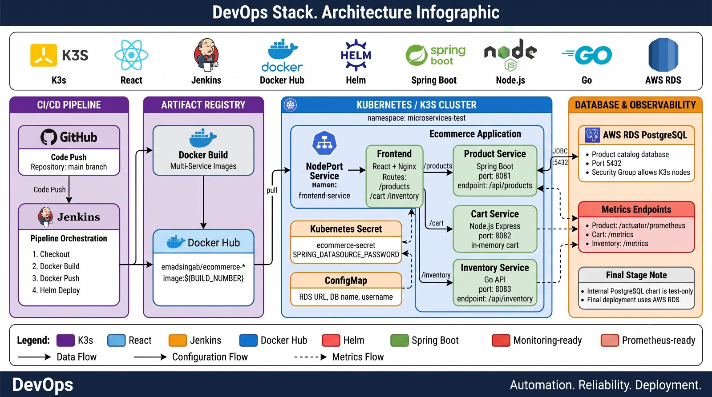

# K3s Microservices Ecommerce CI/CD Stack

A hands-on DevOps lab project that demonstrates how to build, containerize, and deploy a microservices-based ecommerce application on Kubernetes/K3s using Docker, Helm, Helmfile, Jenkins, and AWS RDS PostgreSQL.

## Architecture



## Project Overview

This project was built in stages to simulate a real DevOps delivery lifecycle:

1. Build multiple application services.
2. Run and test services locally.
3. Containerize each service with Docker.
4. Deploy services manually using Kubernetes manifests.
5. Package deployments using Helm charts.
6. Manage multi-service releases using Helmfile.
7. Automate build, push, and deployment using Jenkins.
8. Connect the product service to AWS RDS PostgreSQL.

The final deployment target is a K3s cluster running inside the `microservices-test` namespace.

## Tech Stack

| Layer | Technology |
|---|---|
| Frontend | React, Nginx |
| Product Service | Java, Spring Boot, Spring Data JPA |
| Cart Service | Node.js, Express |
| Inventory Service | Go |
| Database | AWS RDS PostgreSQL |
| Containerization | Docker |
| Registry | Docker Hub |
| Orchestration | Kubernetes / K3s |
| Packaging | Helm |
| Release Management | Helmfile |
| CI/CD | Jenkins |
| Observability | Prometheus-ready metrics endpoints |

## Microservices

| Service | Port | Description |
|---|---:|---|
| `frontend` | 80 | React UI served by Nginx and used as the reverse proxy entrypoint |
| `product-service-java` | 8081 | Product catalog API connected to PostgreSQL |
| `cart-service-node` | 8082 | Cart API using in-memory cart state for lab purposes |
| `inventory-service-go` | 8083 | Inventory availability API |
| `AWS RDS PostgreSQL` | 5432 | Final product database |

## Repository Structure

```text
.
|-- frontend/                 # React frontend served by Nginx
|-- product-service-java/     # Spring Boot product service
|-- cart-service-node/        # Node.js cart service
|-- inventory-service-go/     # Go inventory service
|-- kubernetes-manifests/     # Raw Kubernetes YAML files
|-- charts/                   # Helm charts for services
|-- docs/                     # Architecture diagram and documentation assets
|-- helmfile.yaml             # Helmfile for managing releases
|-- compose.yaml              # Docker Compose local/testing environment
|-- Jenkinsfile               # CI/CD pipeline
`-- README.md
```

## Project Stages

| Stage | Branch / Files | Purpose |
|---|---|---|
| Application source | `containerized-applications` | Initial service source code |
| Local testing | `local-test` | Run services manually and test APIs |
| PostgreSQL integration | `feat/product-service-postgres` | Connect product service to PostgreSQL |
| Docker Compose | `compose.yaml` | Local multi-container testing |
| Kubernetes manifests | `kubernetes-manifests/` | Manual Kubernetes deployment stage |
| Helm charts | `charts/` | Package each service as a Helm chart |
| Helmfile | `helmfile.yaml` | Manage multiple Helm releases from one file |
| Jenkins pipeline | `Jenkinsfile` | Automate build, push, and deploy |

## Final Deployment Flow

```text
GitHub push
    |
    v
Jenkins checkout
    |
    v
Docker build
    |
    v
Docker Hub push
    |
    v
Helm / Helmfile deployment
    |
    v
K3s cluster
    |
    v
AWS RDS PostgreSQL
```

## Docker Images

The Jenkins pipeline builds and pushes these images to Docker Hub:

```text
emadsingab/ecommerce-product-service-java
emadsingab/ecommerce-cart-service-node
emadsingab/ecommerce-inventory-service-go
emadsingab/ecommerce-frontend
```

The image tag is based on the Jenkins build number:

```text
${BUILD_NUMBER}
```

## Kubernetes Namespace

The final deployment uses:

```text
microservices-test
```

Make sure Helm values and Jenkins deployment commands use the same namespace.

## AWS RDS Configuration

The final deployment uses AWS RDS PostgreSQL for the product service database.

The internal PostgreSQL Kubernetes manifest and Helm chart are kept as part of the testing stage only. They are not required for the final RDS-based deployment.

Before deploying the product service, create the database password Secret:

```bash
kubectl create namespace microservices-test

kubectl create secret generic ecommerce-secret \
  -n microservices-test \
  --from-literal=SPRING_DATASOURCE_PASSWORD='YOUR_RDS_PASSWORD'
```

The RDS security group must allow the K3s nodes to connect to port `5432`.

## Helm Deployment

Deploy each service manually with Helm:

```bash
helm upgrade --install product-app ./charts/product-service \
  --namespace microservices-test \
  --create-namespace \
  --set namespace=microservices-test

helm upgrade --install cart-app ./charts/cart-service \
  --namespace microservices-test \
  --create-namespace \
  --set namespace=microservices-test

helm upgrade --install inventory-app ./charts/inventory-service \
  --namespace microservices-test \
  --create-namespace \
  --set namespace=microservices-test

helm upgrade --install frontend-app ./charts/frontend-service \
  --namespace microservices-test \
  --create-namespace \
  --set namespace=microservices-test \
  --set service.type=NodePort
```

## Helmfile Deployment

Helmfile is used to manage multiple Helm releases from one place instead of deploying each chart manually.

Apply all releases:

```bash
helmfile apply
```

Preview changes before applying:

```bash
helmfile diff
```

## Jenkins CI/CD Pipeline

The Jenkins pipeline performs:

1. Checkout source code from GitHub.
2. Build Docker images for all services.
3. Login to Docker Hub using Jenkins credentials.
4. Push images to Docker Hub.
5. Deploy services to K3s using Helm commands.

Required Jenkins credential:

```text
docker-creds
```

## Local Development

### Product Service

```bash
cd product-service-java
mvn spring-boot:run
```

Test:

```bash
curl http://localhost:8081/api/products
curl http://localhost:8081/actuator/prometheus
```

### Cart Service

```bash
cd cart-service-node
npm install
npm start
```

Test:

```bash
curl http://localhost:8082/health
curl http://localhost:8082/metrics
```

### Inventory Service

```bash
cd inventory-service-go
go mod tidy
go run .
```

Test:

```bash
curl http://localhost:8083/health
curl http://localhost:8083/api/inventory/1
curl http://localhost:8083/metrics
```

### Frontend

```bash
cd frontend
npm install
npm run dev -- --host 0.0.0.0
```

Default Vite proxy routes:

```text
/products  -> http://localhost:8081
/cart      -> http://localhost:8082
/inventory -> http://localhost:8083
```

## Observability

This project exposes Prometheus-ready metrics endpoints. It does not deploy a full Prometheus/Grafana stack by default.

| Service | Health Endpoint | Metrics Endpoint |
|---|---|---|
| Product Service | `/actuator/health` | `/actuator/prometheus` |
| Cart Service | `/health` | `/metrics` |
| Inventory Service | `/health` | `/metrics` |

## Team Members

Add team members here before publishing:

```text
1. Team Member Name
2. Team Member Name
3. Team Member Name
```

## Notes

- The cart service uses in-memory storage because this is a DevOps deployment lab.
- The product service is the only service connected to PostgreSQL.
- The final database target is AWS RDS PostgreSQL.
- The internal PostgreSQL manifests/charts are kept for testing and learning stages.
- Helmfile is included to organize and manage multi-service Helm releases.

## Project Goal

The goal of this project is to practice the full DevOps lifecycle:

- Microservices containerization
- Docker image versioning
- Kubernetes/K3s deployment
- Helm chart packaging
- Helmfile release management
- Jenkins CI/CD automation
- External database integration with AWS RDS
- Health checks and metrics endpoints
